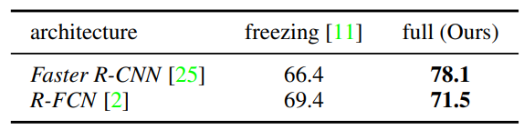

- CVPR 2018
- [Paper](https://arxiv.org/pdf/1804.06516.pdf)
- Simulation에서 Domain Randomization 기법을 적용하여 low cost로 대량의 이미지를 합성하여 데이터셋을 만들고 성능을 향상시키는 방법에 대해 제안

<!--more-->

# Introduction

직접 데이터셋을 구축하는 경우, 데잍어를 취득하고 Labeling 하는 데 많은 시간과 비용이 발생한다. 이런 문제를 해결하기 위해 Simulator로 실제 이미지와 비슷한 이미지를 생성하는 연구들이 많이 존재한다. 하지만 이 또한 Simulator를 제작하는 시간, 비용, 인력 등이 필요한 것은 마찬가지며 한계이다.
그렇기 때문에 Domain Randomization 기법을 적용하여 low cost로 대량의 이미지를 합성하여 데이터셋을 만들고 향상시키는 방법에 대해 제안한다.

- Domain Randomization을 Object Detection에 적용하는 방법 제안
- Domain Randomization에 flying distractors 를 제안하여 정확도 향상
- Domain Randomization의 주요 parameter들에 대한 분석을 통해 각각의 중요성 평가

## Synthetic Dataset

- SYNTHIA (http://synthia-dataset.net/)
- GTA V (https://arxiv.org/pdf/1608.02192.pdf)
- Sim4CV (https://sim4cv.org/#portfolioModal2)
- Virtual KITTI (http://www.europe.naverlabs.com/Research/Computer-Vision/Proxy-Virtual-Worlds)

---

# Previous Work

- On Pre-Trained Image Features and Synthetic Images for Deep Learning
    - pretrained weight를 사용하여 앞 단의 layer는 freezing 시키는 식으로 fine-tuning을 하는 반면, 본 논문에서는 freezing 시키는 방법을 사용하지 않는 것이 더 성능이 좋다고 주장
- Driving in the matrix: Can virtual world replace human-generated annotations for real world tasks?
    - Photorealistic Synthetic 데이터셋을 이용하여 자동차를 detection 하는 문제 해결. 본 논문에서는 Photorealistic Synthetic 데이터셋 사용 대신 Domain Randomization 기반의 Synthetic 데이터셋 사용

---

# Methods

- 랜덤 갯수의 Object (interest object)를 3D Scene의 랜덤한 position, orientation에 위치 시킨다.
- flying distractors: 네트워크가 관심없는 object에 대해 관심을 갖지 않게 하기위해서 scene에 random 한 갯수의 geometric shapes를 추가한다.
- interest object와 flying distractors에 랜덤한 texture 를 적용한다.
- interest object에 랜덤하게 location, camera viewpoint, background image, light 등 변화를 준다.
- 자동으로 GT label 데이터를 뽑아내서 네트워크 training에 사용한다.
- Unreal Engine 사용 1200 x 400 이미지 기준 30Hz

---

# Evaluation

VKITTI dataset에 비해 Domain Randomization 이미지가 분명 이상하다. 하지만 Domain Randomization을 이용하면 VKITTI와 같이 공을 들여 데이터를 생성하는 것 보다 훨씬 간단하고 빠르게 데이터 생성이 가능하다. VKITTI 는 segmentation, depth, optical flow 계산 등 복잡한 계산들이 수반되어 데이터 생성에 보다 많은 시간이 소요된다. 

Domain Randomization으로 생성된 데이터로 학습을 시키면 정확도가 좋아진다. 
DR dataset은 100K 이용하고 VKITTI dataset은 2.5K 개 이용
- 동등한 비교는 아니지만, 데이터가 부족해서 데이터를 많이 생성해야 하는 상황에서 VKITTI 같이 복잡하고 느린  과정을 거치지 않아도 손쉽게 VKITTI와 유사한 성능을 내는 것이 목표이기 때문에 큰 문제 없다.
- training 시 data augmentation을 위해 random 하게 brightness, contrast, Gaussian noise를 줬다.
- classic한 augmentation 방법인 flips, resizing, box jitter, crop 등도 사용

Synthetic image로 training 시킨 후 real image로 fine tuning 해봤다. 기존의 hyperparameter를 변경하지 않고 gradient가 end-to-end로 fully flow 하도록, 네트워크가 수렴할 때까지 training 시켰다. 

Faster R-CNN 으로 Bounding Box를 찾은 결과물. VKITTI와 DR 모두 real data 는 사용하지 않았음에도 불구하고 실제 이미지에 대해 예측이 정확하다.

- Real 데이터로 fine-tuning 했을 때의 결실제 training 하는 이미지 수가 증가함에 따라 DR은 VKITTI를 능가한다. 실제 데이터와 비슷한 데이터가 추가되는 것 보다 데이터 자체가 많아지는 것이 더 중요했다. 
- 초기에는 데이터가 부족할 수 있지만 일정 시간이 지나면 real 데이터가 취득될 수 있다. 당연히 real 데이터가 많아질 수록 성능이 높아진다. 결과적으로도 DR로 생성한 데이터를 같이 사용했을 때 가장 높은 성능을 보인다.
- 즉, 데이터가 부족한 초반 부터 데이터가 충분히 쌓인 후반 부분에 걸쳐 DR 이 사용될 수 있다.

Domain Augmentation을 어떻게 했는지에 따라 AP가 다르다

이전 논문에서는 synthetic data로 네트워크를 training 시킬 때 early network (feature extraction 부분)를 freeze 시켰다. 하지만 본 연구에서 테스트 했을 때, early network를 freeze 했을 때 정확도가 더 낮았다. 다양한 데이터가 전체적인 training을 유리하게 하는데, weight를 고정하면 이러한 변화를 막기 때문에 성능이 떨어진다.

---

# Conclusion

DR은 Photo realism을 버리고 training 할 때 synthetic 이미지를 교란시킴으로써 네크워크가 중요한 영역에만 집중하도록 했다. real data로 fine-tuning 하면 realistic 한 dataset 보다 성능이 더 뛰어나고, 적은 양의 실제 데이터만 사용하여 얻은 결과보다 낫다.
