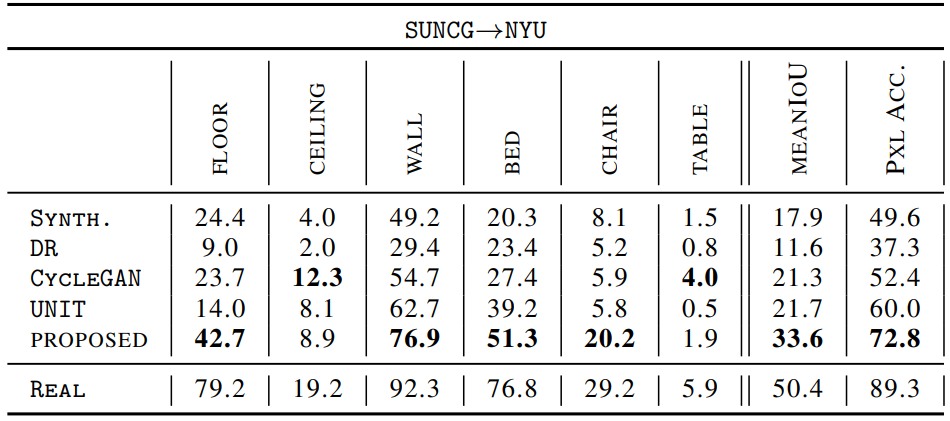

A Strong, Simple Baseline for Synthetic to Real Image Domain Adaptation

<!--more-->

# Paper

- 2018
- https://arxiv.org/pdf/1807.09384.pdf

---

# Introduction

- CG로 렌더링된 depth image를 이용한 학습 모델은 Object Detection 할 때 잘 동작되었다. 그러나 RGB 같은 경우 realistic한 RGB 이s미지를 렌더링하기 어렵기 때문에 성공을 거두지 못했었다.
- GAN 을 기반으로 synthetic 이미지와 real 이미지를 구별할 수 없도록 discriminator를 학습시킨다. 하지만 이 방법은 GAN 문제를 위한 어려움들이 있었다.
- 본 연구에서는 real 이미지와 synthetic 이미지를 무작위로 페어링해서 real 이미지의 스타일을 synthetic 이미지로 transfer 한다. feature transform, smoothing 을 통해 style transfer가 구성된다. stylized 된 synthetic image가 synthetic-to-real 에 더 좋은 결과를 보여준다.
- 무작위로 선택된 style의 이미지는 원하지 않은 결과를 초래할 수 있다. 이상적으로는 real 이미지, synthetic 이미지에서 최상의 스타일 이미지를 선택해야 하지만, 이것은 계산 비용이 많이 든다. 결국 human resource가 필요하다. 따라서 무작위로 선택된 N 개 스타일의 이미지를 사용한다.

# Methods

Stylized Synthetic Image를 Semantic Segmentation 문제에 적용에 풀어봤다. DS(Domain Stylization), SSL(Semantic Segmentation Learning) 단계가 반복해서 이루어진다.

처음에는 segmentation mask 정보 없이 stylized synthetic dataset를 생성한다. 모든 픽셀에 segmentation mask를 1로 할당하는 거다.

그리고 $D_0^S$ 로 semantic segmentation 네트워크 ($s_0$) 를 training 시킨다. training 된 semantic segmentation 네트워크는 real image의 semantic segmentation mask를 계산하는 데에 사용된다. ($s_0(X_j^R)$) 이제 synthetic dataset은 real image에서 만들어진 segmentation mask 와 함께 stylized된 synthetic dataset 이 된다. 수식으로 정리해 표현하면 아래와 같다.

stylized된 dataset은 새로운 segmentation network ($s_1$) 를 training 시키는데에 사용된다.
이 두가지 스텝을 반복하며 네트워크를 학습시킨다.

---

# Evaluation

