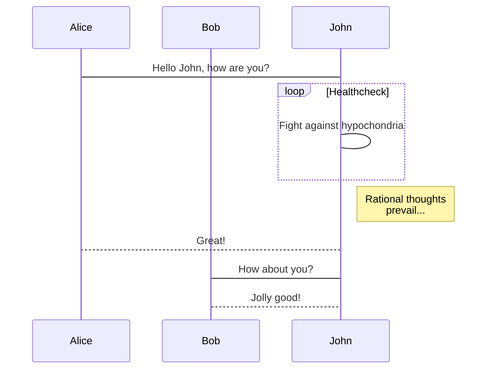
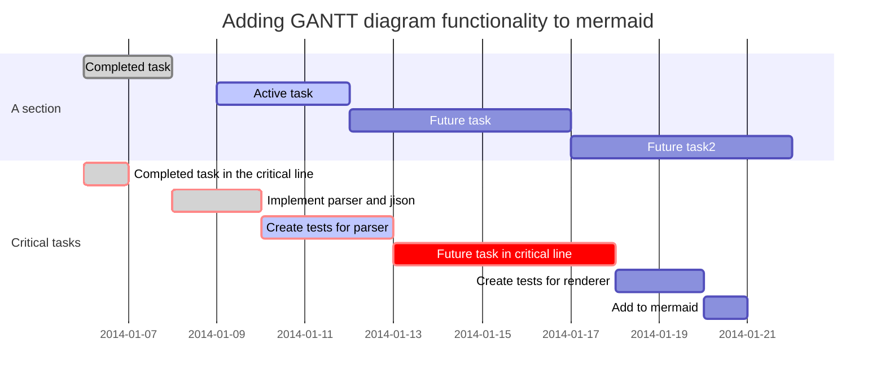

# Text

## Definition

[Documentation](https://tianqi.name/jekyll-TeXt-theme/docs/en/additional-styles)

kramdown
: A Markdown-superset converter

Maruku
:     Another Markdown-superset converter

```
kramdown
: A Markdown-superset converter

Maruku
:     Another Markdown-superset converter
```

## Footnote

Here is a footnote reference,[^1] and another.[^longnote]

[^1]: Here is the footnote.

[^longnote]: Here’s one with multiple blocks.

    Subsequent paragraphs are indented to show that they
belong to the previous footnote.

    Here is a footnote reference,[^1] and another.[^longnote]

    [^1]: Here is the footnote.

    [^longnote]: Here’s one with multiple blocks.

        Subsequent paragraphs are indented to show that they
    belong to the previous footnote.

## Alert

Success Text.
{:.success}

Info Text.
{:.info}

Warning Text.
{:.warning}

Error Text.
{:.error}

## Tag

`success`{:.success} `info`{:.info} `warning`{:.warning} 
`error`{:.error}

## Extra

| Name | Description |
| ---- | ---- |
| Spacing | [Doc](https://tianqi.name/jekyll-TeXt-theme/docs/en/spacing) |
| Grid | [Doc](https://tianqi.name/jekyll-TeXt-theme/docs/en/grid) |
| Icons | [Doc](https://tianqi.name/jekyll-TeXt-theme/docs/en/icons) |
| Image | [Doc](https://tianqi.name/jekyll-TeXt-theme/docs/en/image) |
| Button | [Doc](https://tianqi.name/jekyll-TeXt-theme/docs/en/button) |
| Item | [Doc](https://tianqi.name/jekyll-TeXt-theme/docs/en/item) |
| Card | [Doc](https://tianqi.name/jekyll-TeXt-theme/docs/en/card) |
| Hero | [Doc](https://tianqi.name/jekyll-TeXt-theme/docs/en/hero) |
| Swiper | [Doc](https://tianqi.name/jekyll-TeXt-theme/docs/en/swiper) |

# Images

## Specify Width and Height

{:width="128px" height="128px"}

**markdown:**

    {:width="128px" height="128px"}

# Embedded

[Documentation](https://tianqi.name/jekyll-TeXt-theme/docs/en/extensions)

With the help of extensions, you can easily add **audios**, **videos**, **slides** and **demos** in your posts.

## YouTube

<div></div>

## CodePen

<div></div>

# MathJax

When $$a \ne 0$$, there are two solutions to $$ax^2 + bx + c = 0$$ and they are

$$x_1 = {-b + \sqrt{b^2-4ac} \over 2a}$$

$$x_2 = {-b - \sqrt{b^2-4ac} \over 2a} \notag$$

<!--more-->

You need set `mathjax: true` in the *_config.yml* or the markdown’s front matter to **enable** it.
{:.warning}

**After MathJax enabled**, you can set `mathjax_autoNumber: true` to have equations be numbered automatically, You can use `\notag` or `\nonumber` to prevent individual equations from being numbered.
{:.info}

[Documentation](https://tianqi.name/jekyll-TeXt-theme/docs/en/markdown-enhancements#mathjax)

**markdown:**

```tex
When $$a \ne 0$$, there are two solutions to $$ax^2 + bx + c = 0$$ and they are
$$x_1 = {-b + \sqrt{b^2-4ac} \over 2a}$$
$$x_2 = {-b - \sqrt{b^2-4ac} \over 2a} \notag$$
```

**front matter:**

    ---
    ...
    mathjax: true
    mathjax_autoNumber: true
    ---

# Mermaid


## Flowchart


    ```mermaid
    graph TD;
        A-->B;
        A-->C;
        B-->D;
        C-->D;
    ```

## Sequence Diagram



    ```mermaid
    sequenceDiagram
        participant Alice
        participant Bob
        Alice->John: Hello John, how are you?
        loop Healthcheck
            John->John: Fight against hypochondria
        end
        Note right of John: Rational thoughts <br/>prevail...
        John-->Alice: Great!
        John->Bob: How about you?
        Bob-->John: Jolly good!
    ```

## Gant Diagrams



    ```mermaid
    gantt
        dateFormat  YYYY-MM-DD
        title Adding GANTT diagram functionality to mermaid
        section A section
        Completed task            :done,    des1, 2014-01-06,2014-01-08
        Active task               :active,  des2, 2014-01-09, 3d
        Future task               :         des3, after des2, 5d
        Future task2              :         des4, after des3, 5d
        section Critical tasks
        Completed task in the critical line :crit, done, 2014-01-06,24h
        Implement parser and jison          :crit, done, after des1, 2d
        Create tests for parser             :crit, active, 3d
        Future task in critical line        :crit, 5d
        Create tests for renderer           :2d
        Add to mermaid
    ```

# Chart

[Documentation](https://tianqi.name/jekyll-TeXt-theme/docs/en/markdown-enhancements#chart)

## Line Chart

```chart
{
  "type": "line",
  "data": {
    "labels": [
      "January",
      "February",
      "March",
      "April",
      "May",
      "June",
      "July"
    ],
    "datasets": [
      {
        "label": "# of bugs",
        "fill": false,
        "lineTension": 0.1,
        "backgroundColor": "rgba(75,192,192,0.4)",
        "borderColor": "rgba(75,192,192,1)",
        "borderCapStyle": "butt",
        "borderDash": [],
        "borderDashOffset": 0,
        "borderJoinStyle": "miter",
        "pointBorderColor": "rgba(75,192,192,1)",
        "pointBackgroundColor": "#fff",
        "pointBorderWidth": 1,
        "pointHoverRadius": 5,
        "pointHoverBackgroundColor": "rgba(75,192,192,1)",
        "pointHoverBorderColor": "rgba(220,220,220,1)",
        "pointHoverBorderWidth": 2,
        "pointRadius": 1,
        "pointHitRadius": 10,
        "data": [
          65,
          59,
          80,
          81,
          56,
          55,
          40
        ],
        "spanGaps": false
      }
    ]
  },
  "options": {}
}
```

```chart
{
    "type": "line",
    "data": {
    "labels": [
        "January",
        "February",
        "March",
        "April",
        "May",
        "June",
        "July"
    ],
    "datasets": [
        {
        "label": "# of bugs",
        "fill": false,
        "lineTension": 0.1,
        "backgroundColor": "rgba(75,192,192,0.4)",
        "borderColor": "rgba(75,192,192,1)",
        "borderCapStyle": "butt",
        "borderDash": [],
        "borderDashOffset": 0,
        "borderJoinStyle": "miter",
        "pointBorderColor": "rgba(75,192,192,1)",
        "pointBackgroundColor": "#fff",
        "pointBorderWidth": 1,
        "pointHoverRadius": 5,
        "pointHoverBackgroundColor": "rgba(75,192,192,1)",
        "pointHoverBorderColor": "rgba(220,220,220,1)",
        "pointHoverBorderWidth": 2,
        "pointRadius": 1,
        "pointHitRadius": 10,
        "data": [
            65,
            59,
            80,
            81,
            56,
            55,
            40
        ],
        "spanGaps": false
        }
    ]
    },
    "options": {}
}
```

## Bar Chart

```chart
{
  "type": "bar",
  "data": {
  "labels": [
    "Red",
    "Blue",
    "Yellow",
    "Green",
    "Purple",
    "Orange"
  ],
  "datasets": [
    {
    "label": "# of Votes",
    "data": [
      12,
      19,
      3,
      5,
      2,
      3
    ],
    "backgroundColor": [
      "rgba(255, 99, 132, 0.2)",
      "rgba(54, 162, 235, 0.2)",
      "rgba(255, 206, 86, 0.2)",
      "rgba(75, 192, 192, 0.2)",
      "rgba(153, 102, 255, 0.2)",
      "rgba(255, 159, 64, 0.2)"
    ],
    "borderColor": [
      "rgba(255,99,132,1)",
      "rgba(54, 162, 235, 1)",
      "rgba(255, 206, 86, 1)",
      "rgba(75, 192, 192, 1)",
      "rgba(153, 102, 255, 1)",
      "rgba(255, 159, 64, 1)"
    ],
    "borderWidth": 1
    }
  ]
  },
  "options": {}
}
```

    ```chart
    {
        "type": "bar",
        "data": {
        "labels": [
        "Red",
        "Blue",
        "Yellow",
        "Green",
        "Purple",
        "Orange"
        ],
        "datasets": [
        {
        "label": "# of Votes",
        "data": [
            12,
            19,
            3,
            5,
            2,
            3
        ],
        "backgroundColor": [
            "rgba(255, 99, 132, 0.2)",
            "rgba(54, 162, 235, 0.2)",
            "rgba(255, 206, 86, 0.2)",
            "rgba(75, 192, 192, 0.2)",
            "rgba(153, 102, 255, 0.2)",
            "rgba(255, 159, 64, 0.2)"
        ],
        "borderColor": [
            "rgba(255,99,132,1)",
            "rgba(54, 162, 235, 1)",
            "rgba(255, 206, 86, 1)",
            "rgba(75, 192, 192, 1)",
            "rgba(153, 102, 255, 1)",
            "rgba(255, 159, 64, 1)"
        ],
        "borderWidth": 1
        }
        ]
        },
        "options": {}
    }
    ```

## Radar Chart

```chart
{
  "type": "radar",
  "data": {
    "labels": [
      "Eating",
      "Drinking",
      "Sleeping",
      "Designing",
      "Coding",
      "Cycling",
      "Running"
    ],
    "datasets": [
      {
        "label": "My First dataset",
        "backgroundColor": "rgba(179,181,198,0.2)",
        "borderColor": "rgba(179,181,198,1)",
        "pointBackgroundColor": "rgba(179,181,198,1)",
        "pointBorderColor": "#fff",
        "pointHoverBackgroundColor": "#fff",
        "pointHoverBorderColor": "rgba(179,181,198,1)",
        "data": [
          65,
          59,
          90,
          81,
          56,
          55,
          40
        ]
      },
      {
        "label": "My Second dataset",
        "backgroundColor": "rgba(255,99,132,0.2)",
        "borderColor": "rgba(255,99,132,1)",
        "pointBackgroundColor": "rgba(255,99,132,1)",
        "pointBorderColor": "#fff",
        "pointHoverBackgroundColor": "#fff",
        "pointHoverBorderColor": "rgba(255,99,132,1)",
        "data": [
          28,
          48,
          40,
          19,
          96,
          27,
          100
        ]
      }
    ]
  },
  "options": {}
}
```

    ```chart
    {
        "type": "radar",
        "data": {
        "labels": [
            "Eating",
            "Drinking",
            "Sleeping",
            "Designing",
            "Coding",
            "Cycling",
            "Running"
        ],
        "datasets": [
            {
            "label": "My First dataset",
            "backgroundColor": "rgba(179,181,198,0.2)",
            "borderColor": "rgba(179,181,198,1)",
            "pointBackgroundColor": "rgba(179,181,198,1)",
            "pointBorderColor": "#fff",
            "pointHoverBackgroundColor": "#fff",
            "pointHoverBorderColor": "rgba(179,181,198,1)",
            "data": [
                65,
                59,
                90,
                81,
                56,
                55,
                40
            ]
            },
            {
            "label": "My Second dataset",
            "backgroundColor": "rgba(255,99,132,0.2)",
            "borderColor": "rgba(255,99,132,1)",
            "pointBackgroundColor": "rgba(255,99,132,1)",
            "pointBorderColor": "#fff",
            "pointHoverBackgroundColor": "#fff",
            "pointHoverBorderColor": "rgba(255,99,132,1)",
            "data": [
                28,
                48,
                40,
                19,
                96,
                27,
                100
            ]
            }
        ]
        },
        "options": {}
    }
    ```

## Polar Area Chart

```chart
{
  "type": "polarArea",
  "data": {
    "datasets": [
      {
        "data": [
          11,
          16,
          7,
          3,
          14
        ],
        "backgroundColor": [
          "#FF6384",
          "#4BC0C0",
          "#FFCE56",
          "#E7E9ED",
          "#36A2EB"
        ],
        "label": "My dataset"
      }
    ],
    "labels": [
      "Red",
      "Green",
      "Yellow",
      "Grey",
      "Blue"
    ]
  },
  "options": {}
}
```

    ```chart
    {
        "type": "polarArea",
        "data": {
        "datasets": [
            {
            "data": [
                11,
                16,
                7,
                3,
                14
            ],
            "backgroundColor": [
                "#FF6384",
                "#4BC0C0",
                "#FFCE56",
                "#E7E9ED",
                "#36A2EB"
            ],
            "label": "My dataset"
            }
        ],
        "labels": [
            "Red",
            "Green",
            "Yellow",
            "Grey",
            "Blue"
        ]
        },
        "options": {}
    }
    ```

## Pie Chart

```chart
{
  "type": "pie",
  "data": {
    "labels": [
      "Red",
      "Blue",
      "Yellow"
    ],
    "datasets": [
      {
        "data": [
          300,
          50,
          100
        ],
        "backgroundColor": [
          "#FF6384",
          "#36A2EB",
          "#FFCE56"
        ],
        "hoverBackgroundColor": [
          "#FF6384",
          "#36A2EB",
          "#FFCE56"
        ]
      }
    ]
  },
  "options": {}
}
```

    ```chart
    {
        "type": "pie",
        "data": {
        "labels": [
            "Red",
            "Blue",
            "Yellow"
        ],
        "datasets": [
            {
            "data": [
                300,
                50,
                100
            ],
            "backgroundColor": [
                "#FF6384",
                "#36A2EB",
                "#FFCE56"
            ],
            "hoverBackgroundColor": [
                "#FF6384",
                "#36A2EB",
                "#FFCE56"
            ]
            }
        ]
        },
        "options": {}
    }
    ```

## Doughnut Chart

```chart
{
  "type": "doughnut",
  "data": {
    "labels": [
      "Red",
      "Blue",
      "Yellow"
    ],
    "datasets": [
      {
        "data": [
          300,
          50,
          100
        ],
        "backgroundColor": [
          "#FF6384",
          "#36A2EB",
          "#FFCE56"
        ],
        "hoverBackgroundColor": [
          "#FF6384",
          "#36A2EB",
          "#FFCE56"
        ]
      }
    ]
  },
  "options": {}
}
```

    ```chart
    {
        "type": "doughnut",
        "data": {
        "labels": [
            "Red",
            "Blue",
            "Yellow"
        ],
        "datasets": [
            {
            "data": [
                300,
                50,
                100
            ],
            "backgroundColor": [
                "#FF6384",
                "#36A2EB",
                "#FFCE56"
            ],
            "hoverBackgroundColor": [
                "#FF6384",
                "#36A2EB",
                "#FFCE56"
            ]
            }
        ]
        },
        "options": {}
    }
    ```

## Bubble Chart

```chart
{
  "type": "bubble",
  "data": {
    "datasets": [
      {
        "label": "First Dataset",
        "data": [
          {
            "x": 20,
            "y": 30,
            "r": 15
          },
          {
            "x": 40,
            "y": 10,
            "r": 10
          }
        ],
        "backgroundColor": "#FF6384",
        "hoverBackgroundColor": "#FF6384"
      }
    ]
  },
  "options": {}
}
```

    ```chart
    {
        "type": "bubble",
        "data": {
        "datasets": [
            {
            "label": "First Dataset",
            "data": [
                {
                "x": 20,
                "y": 30,
                "r": 15
                },
                {
                "x": 40,
                "y": 10,
                "r": 10
                }
            ],
            "backgroundColor": "#FF6384",
            "hoverBackgroundColor": "#FF6384"
            }
        ]
        },
        "options": {}
    }
    ```
